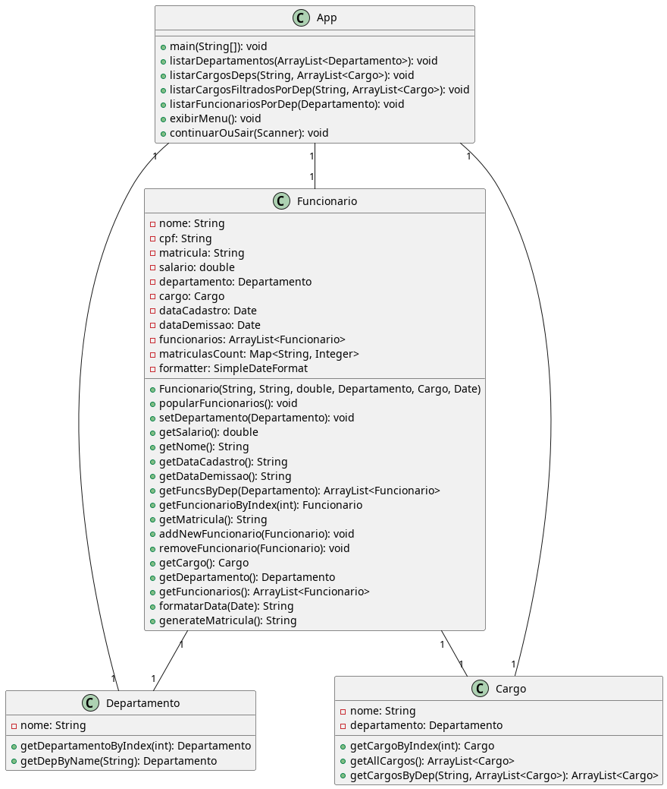

# Projeto Java de Gerenciamento de Funcionários
<ul>
  <li><strong>Conceito: </strong>Projeto de Sistema Java de Gerenciamento de Funcionários desenvolvido como um dos projetos finais do curso de Programação Orientada a Objetos do Oxetech Lab, orientado por Ulpio Netto.</li>
  <li>
    <strong>Dupla: </strong> Wendel e Isabelle
  </li>
</ul>

# Diagrama UML de Classes

